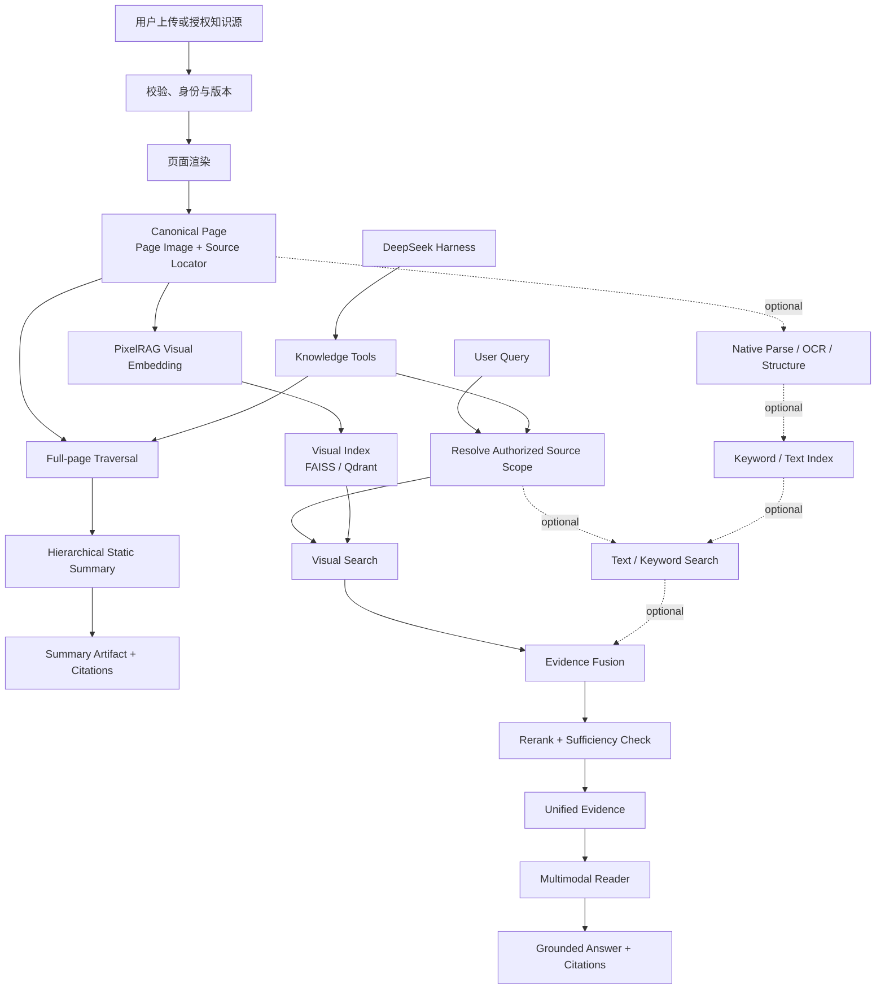

# PDF Knowledge Agent — 后续实现 Pipeline

> 状态：实施路线草案  
> 更新日期：2026-08-21  
> 产品愿景来源：[PROJECT_REQUIREMENTS.md](./PROJECT_REQUIREMENTS.md)  
> 目标结构来源：[agent_structure.md](./agent_structure.md)

## 1. 文档目的

本文把最新项目愿景和系统结构转换为可执行的后续实现顺序，并明确 PixelRAG 在项目中的作用。

本文不修改产品边界，也不把尚未验证的技术选型描述为已经交付。实现中如果出现冲突，以 `PROJECT_REQUIREMENTS.md` 的产品愿景为准。

## 2. PixelRAG 在本项目中的定位

PixelRAG 是一个 pixel-native visual retrieval 项目。它把网页、PDF 或图片渲染为截图或图像 tile，直接对图像生成视觉向量，并通过视觉索引检索相关页面。检索到的页面图像随后可以交给多模态 Reader Model 阅读。

官方实现提供的主要能力包括：

- `pixelshot`：把网页、PDF 和图片渲染为截图或 tile；
- `pixelrag chunk`、`embed`、`build-index`：把图像 tile 转换为向量并建立索引；
- `pixelrag index`：编排 source → ingest → embed → index；
- `pixelrag serve`：通过搜索接口查询 FAISS 或 Qdrant 索引；
- 基于 `Qwen3-VL-Embedding` 的视觉 Embedding；
- PDF 页面、宽页面二维切分、增量重建和元数据过滤。

PixelRAG 对本项目的核心价值是：

1. PDF 不必先成功 OCR 才能进入检索系统；
2. 表格、图表、公式、布局和图文关系可以保留在页面图像中；
3. 查询可以直接召回视觉相关页面，再由多模态 Reader 读取；
4. 文本检索可以从唯一主路径降为辅助召回和精确匹配路径。

PixelRAG **不是**本项目的完整知识库或 Agent 框架。它不应负责：

- 文档身份、版本、权限和生命周期；
- Canonical Knowledge 与 Source Locator；
- 静态总结的完整页面遍历与分层聚合；
- Evidence 统一建模；
- Grounded Answer 与引用校验；
- DeepSeek Harness Session、Tools 和 Agent Loop；
- 网站、本地文件夹授权和用户长期记忆。

因此，PixelRAG 应作为 `Visual Retrieval Module` 后面的一个 adapter，而不是成为整个系统的新中心：

```text
Knowledge Domain
  -> Visual Retrieval interface
      -> PixelRAG adapter
          -> render / embed / index / search
```

未来如果出现第二种视觉检索实现，可以在同一 seam 下增加新的 adapter；上层 Retrieval、Summary、Grounded Answer 和 Agent Tools 不需要理解 PixelRAG 的私有文件结构或命令参数。

## 3. 目标端到端 Pipeline



这条主干包含两个不同的消费路径：

- **静态总结路径**必须遍历选定范围内的全部页面，不能用 Top-K 检索代替覆盖式总结；
- **动态查询路径**只召回少量相关页面，目标是回答当前问题。

二者共享 Canonical Page、Source Locator 和 Knowledge Repository，但具有不同的覆盖目标和评测指标。

## 4. Ingestion Pipeline

```text
Upload / Authorized File
  -> Validate type, size and ownership
  -> Compute source_id, content_hash and version
  -> Store original file
  -> Create processing state: received
  -> Render PDF into stable page images
  -> Persist page_id, page_number and source locator
  -> Optional native parse / OCR / structure extraction
  -> Persist Canonical Page records
  -> PixelRAG visual embedding
  -> Build or update visual index
  -> Optional text / keyword index
  -> Validate page count and index metadata
  -> Mark source: ready | partial | failed
```

关键约束：

- 原始 PDF、页面图像和页面身份由 Knowledge Repository 管理；
- PixelRAG manifest、Embedding 和索引属于可重建派生数据；
- `page_id`、`document_id`、`source_locator` 和版本由项目自己的 domain model 生成；
- PixelRAG adapter 必须维护项目稳定 ID 与 PixelRAG tile/index ID 的映射；
- OCR 或原生解析失败时，视觉路径仍可继续；
- 页面渲染或视觉索引失败时，不得把资料标记为完整可查询；
- 不可信 PDF 的渲染、解析和 OCR 应在受限 worker 中执行。

## 5. Static Summary Pipeline

```text
Authorized source_scope
  -> Repository enumerates every Canonical Page
  -> Page grouping by document order and size budget
  -> Multimodal Reader reads page groups
  -> Local summaries with page citations
  -> Section-level aggregation
  -> Document-level aggregation
  -> Multi-document aggregation when requested
  -> Citation mapping and faithfulness validation
  -> Save versioned Summary Artifact
```

PixelRAG 在此路径中不是 Top-K 页面选择器。它可以复用页面渲染结果和图像预处理能力，但静态总结必须从 Repository 确认完整页面集合，避免遗漏“对查询不相关、但对全局总结重要”的内容。

静态总结需要独立验证：

- 页码覆盖率；
- 章节覆盖率；
- 关键结论忠实度；
- 引用正确性；
- 跨页与跨文档一致性；
- 源文件更新后的 artifact 失效与重建。

## 6. Dynamic Query Pipeline

```text
User Query
  -> Resolve user authorization and source_scope
  -> Prepare text or image query
  -> PixelRAG visual search
  -> Optional keyword / text embedding search
  -> Convert every result into EvidenceCandidate
  -> Fuse and deduplicate by document_id + page_id
  -> Rerank
  -> Check evidence sufficiency
  -> Load original page images and optional text
  -> Multimodal Reader reads Evidence
  -> Generate grounded claims
  -> Map claims to source locators
  -> Validate grounding
  -> Return answer, citations and limitations
```

统一 Evidence interface 至少包含：

```text
Evidence
├─ evidence_id
├─ document_id
├─ page_id
├─ source_locator
├─ representation_type
├─ retrieval_channel
├─ retrieval_score
├─ page_image_ref
├─ optional_text
└─ diagnostics
```

PixelRAG 搜索结果必须先转换为该 interface，Grounded Answer Module 不直接消费 PixelRAG 私有返回格式。

## 7. Agent 调用 Pipeline

```text
User
  -> DeepSeek Harness Session
  -> Intent and current source_scope
  -> Tool selection
  -> Tool schema validation
  -> Authorization and scope guard
  -> Knowledge Plugin
  -> Domain request
  -> Summary / Retrieval / Comparison / Artifact Module
  -> Structured domain result
  -> Knowledge Plugin result mapping
  -> Harness Session event
  -> Final response
```

模型可见 Tool 保持窄 interface：

- `list_sources`；
- `inspect_source`；
- `summarize_sources`；
- `search_evidence`；
- `compare_sources`；
- `get_artifact`。

模型不直接调用 `pixelrag index build`、FAISS、Qdrant、Embedding 模型、任意路径、SQL 或 Shell。这些属于 domain module 与 infrastructure adapter 的实现细节。

## 8. Incremental Update Pipeline

```text
File event or explicit refresh
  -> Recompute content hash
  -> Compare source version
  -> No change: stop
  -> Changed: create new source version
  -> Re-render affected document
  -> Rebuild Canonical Pages
  -> Rebuild PixelRAG-derived embeddings and index entries
  -> Rebuild optional text index entries
  -> Invalidate dependent Summary Artifacts
  -> Validate new page/index mapping
  -> Atomically activate new version
  -> Garbage-collect old derived data later
```

更新过程中，旧版本在新版本完整通过验证前继续可读，避免出现页面图像、Embedding 与 metadata 指向不同版本的情况。

## 9. 推荐实施顺序

### Stage 0：锁定 Contracts 与评测样本

先确定最小稳定 interface：

- `Document`、`Page`、`SourceLocator`；
- `ProcessingState`；
- `Evidence`；
- `SummaryArtifact`；
- `source_scope`；
- Visual Retrieval request/result。

准备代表性小样本：原生文本、扫描页、表格、图表、公式、多栏与混合图文 PDF，并给出页面级检索标注。

完成条件：adapter 可以在不暴露私有格式的前提下，通过这些 contracts 被替换和测试。

### Stage 1：PixelRAG 技术 Spike

只实现一个最小垂直切片：

```text
1 PDF
  -> render
  -> visual embed
  -> local index
  -> text query
  -> Top-K page IDs
  -> open original page image
```

必须验证：

- Windows 上 PDF render、Embedding、索引和 serve 的实际可运行性；
- CPU、GPU、显存、内存、磁盘和耗时；
- 表格、图表、公式和扫描页的 Page Hit Rate；
- PDF 页码与 PixelRAG tile/index metadata 的稳定映射；
- 中文查询和中文 PDF 的召回质量；
- 删除、重命名、更新 PDF 后索引是否正确刷新；
- 当前 PixelRAG 版本或 commit 的可复现安装。

完成条件：同一个小型评测集可以重复构建索引，并返回正确的项目 `page_id` 与来源页码。Spike 未通过前，不围绕 PixelRAG 私有格式扩建上层模块。

### Stage 2：Knowledge Repository 与 Visual Retrieval seam

- 建立 Canonical Page 存储；
- 封装原始文件、页面图像、metadata 和 processing state；
- 实现 `PixelRagVisualRetrievalAdapter`；
- adapter 输出统一 `EvidenceCandidate`；
- 为 adapter 提供内存 fake，用于上层模块测试。

完成条件：删除 PixelRAG adapter 后，复杂性只回到 Visual Retrieval seam，不扩散到 Summary、Grounded Answer 或 Harness Plugin。

### Stage 3：Ingestion 与可观察状态

- 实现上传、校验、身份、版本、渲染和存储；
- 接入 PixelRAG Embedding 与索引；
- 添加 optional parse/OCR；
- 建立 worker、重试、取消和资源限制；
- 输出 page-level 状态与诊断。

完成条件：一份 PDF 可以稳定进入 `ready`，失败时明确落入 `partial`、`failed` 或 `cancelled`，且来源定位可验证。

### Stage 4：Visual Retrieval 与 Grounded Answer

- 完成 visual search；
- 视评测结果加入 text/keyword 辅助检索；
- 实现 fusion、dedup、rerank 和 evidence sufficiency；
- 接入多模态 Reader；
- 完成引用映射与 grounding validation。

完成条件：代表性 PDF 可以完成带页码引用的问答；证据不足时返回明确限制。

### Stage 5：Static Summary

- 完整遍历选定页面；
- 建立 page grouping 和层级总结；
- 支持单文档与多文档总结；
- 保存 versioned artifact；
- 实现引用、覆盖率和忠实度验证。

完成条件：长 PDF 不依赖单次上下文，多文档总结保留各文档身份与来源。

### Stage 6：DeepSeek Harness 接入

- 建立 Profile、Bundle 与 Knowledge Plugin；
- 先接入 `list_sources` 和 `inspect_source`；
- 再接入 `summarize_sources`、`search_evidence`、`compare_sources` 和 `get_artifact`；
- 用 Session typed events 保存 `source_scope`、artifact refs 和任务状态；
- 禁止模型绕过 Tools 访问 PixelRAG 或本地路径。

完成条件：一次完整 Harness turn 能产生可审计的 Tool Call、Tool Result、Evidence 引用和最终回答。

### Stage 7：网站端到端闭环

- 文档上传与处理状态；
- 文档库与 source selector；
- Summary、Chat、Citation Viewer 和 Artifact Viewer；
- 用户身份、资料隔离、删除和错误状态；
- 后台 worker、队列、存储、监控和生产部署。

完成条件：新用户无需运行服务器命令即可上传 PDF、查看总结、提问并打开原始页引用。

### Stage 8：本地知识库与增量更新

- 文件夹授权与 watcher；
- content hash、版本检查和增量索引；
- 受控本地 runtime；
- 明确本机处理与外部模型调用；
- artifact 失效和重建。

完成条件：文件新增、修改、移动和删除后，知识库与引用保持一致。

### Stage 9：多模态扩展

在 PDF pipeline 稳定后，通过新的 source adapter 扩展 Web、Image、Audio 和 Video：

- Web / Image 可以复用 PixelRAG 视觉表示；
- Audio 需要 transcript 与 time-range locator；
- Video 需要 transcript、关键帧或 frame-range locator；
- 所有来源最终转换为统一 Evidence interface；
- Summary、Search、Compare 和 Grounded Answer interface 保持不变。

## 10. PixelRAG 采用决策门槛

PixelRAG 只有在 Stage 1 Spike 达到以下条件后，才从候选 adapter 升级为默认 visual retrieval adapter：

1. Windows 或目标部署环境可复现运行；
2. 中文与复杂 PDF 的 Page Hit Rate 达到项目基线；
3. 页码、tile 和索引 metadata 映射稳定；
4. 更新和删除不会产生陈旧索引或错误引用；
5. 资源成本适合网站与本地部署目标；
6. Reader 可以读取召回页面并生成正确引用；
7. 失败时可以降级到文本检索或返回明确限制；
8. 版本或 commit 被固定，升级经过回归评测。

如果 PixelRAG 未通过其中某项，应保留 Visual Retrieval interface，替换 adapter 或采用视觉检索与文本检索并行方案，而不是改写上层产品模型。

## 11. 暂不锁定的实现细节

以下内容需要 Spike 和评测后再决定：

- PixelRAG 的固定版本或 commit；
- 直接嵌入 Python package，还是通过独立 search process 接入；
- FAISS 或 Qdrant；
- `Qwen3-VL-Embedding-2B` 原始模型或 PixelRAG LoRA adapter；
- 页面级 chunk 或进一步 tile 化策略；
- visual/text fusion 算法；
- reranker；
- Multimodal Reader Model；
- 网站和本地部署的硬件最低要求。

这些选择不得改变已经确定的 module 职责、source scope、Canonical Knowledge、Evidence interface 和来源可追溯原则。

## 12. 官方参考

- [PixelRAG GitHub](https://github.com/StarTrail-org/PixelRAG)
- [PIXELRAG paper](https://arxiv.org/abs/2606.28344)
- [PixelRAG releases](https://github.com/StarTrail-org/PixelRAG/releases)

