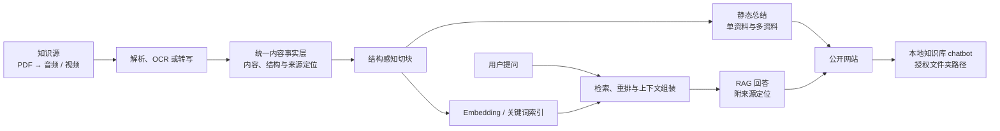

# PDF Summarize

> 从 PDF 总结与 RAG 出发，构建可公开使用、可本地部署，并最终支持音视频的个人知识库助手。

PDF Summarize 首先处理单份或多份复杂 PDF。它不把“调用一次大模型”当作总结或问答的全部工作，而是先建立可靠的数据流水线：解析原生文本与结构、识别信息缺失、按需补充 OCR，并将不同来源的内容统一成可追溯的标准内容。

在这条内容主干上，项目同时提供覆盖式静态总结和带来源的 RAG 问答；后续再完成正式公开网站、可读取用户授权文件夹的本地知识库 chatbot，并把同一套能力扩展到音频和视频。

> [PROJECT_REQUIREMENTS.md](./PROJECT_REQUIREMENTS.md) 是本项目唯一的正式需求来源。README 只负责产品介绍；两者冲突时，以项目要求为准。

## 为什么需要这个项目

真实 PDF 往往同时包含原生文本、扫描图片、表格、公式、图示和复杂版式。直接把解析出的长文本交给大模型，通常会遇到以下问题：

- 扫描页或图片中的关键信息被遗漏；
- 页面顺序、标题层级、表格和图片关系被破坏；
- 原生文本与 OCR 文本重复或冲突；
- 长文档超过模型上下文窗口；
- 摘要结论无法追溯到具体文档和页码；
- 后续检索与问答重复建设另一套数据处理流程。

PDF Summarize 的核心思路是先形成统一、稳定、带来源信息的 canonical document，再让静态总结、向量检索、RAG 和对话记忆共享同一份文档事实层。

## 整体架构



这不是几条彼此独立的功能线。静态总结、RAG、公开网站、本地助手和多模态扩展必须共享同一条知识处理主干：

```text
知识源
  -> 解析 / OCR / 转写
  -> 统一、可追溯的内容
  -> 切块
  -> 静态总结 / 索引与 RAG
  -> 公开网站
  -> 本地知识库助手
```

## 分阶段愿景

### 第一阶段：PDF 总结与 RAG 后端

系统接收单份或多份 PDF，完成内容提取、选择性 OCR、统一建模、结构感知切块、静态总结、索引和带来源的 RAG 问答。

静态总结与 RAG 是两条不同的消费路径：

- 静态总结覆盖用户选定资料的重要内容，生成单文档或多文档结构化结果；
- RAG 根据用户问题检索相关证据，支持指定资料范围、多轮追问和来源核对。

典型流程：

```text
读取 N 份 PDF
  -> 原生解析与选择性 OCR
  -> Canonical Document
  -> 结构感知切块
  ├─-> 分层静态总结与跨文档聚合
  └─-> 索引、检索、重排与 RAG 回答
```

### 第二阶段：正式公开网站

将第一阶段的真实后端能力接入面向最终用户的网页，并完成生产部署。用户通过公开网址即可提交资料、查看处理状态、生成总结、提问并核对引用。

这一阶段包括：

- 正式前端，而不是脚本或接口演示；
- 前端、后端、耗时任务、数据保存和错误反馈打通；
- 可重复的生产部署与公开访问入口；
- 浏览器授权的文件选择或上传流程；
- 密钥、用户资料和部署配置的正确隔离。

远程托管的网站不能直接读取用户电脑的任意文件夹路径。本地路径能力属于下一阶段。

### 第三阶段：可本地部署的个人知识库助手

把已经验证的网站产品转化为普通用户可以部署在自己电脑上的知识库 chatbot。用户明确授权一个或多个本地文件夹后，系统发现和处理其中受支持的资料，并持续维护相应知识库。

这一阶段包括：

- 配置本地文件夹及子文件夹范围；
- 对新增、修改、移动和删除的资料更新知识库；
- 按文件、文件夹或资料集合限定总结与提问范围；
- 提供可复现的本地安装、配置和运行文档；
- 明确哪些处理在本机完成，哪些可能调用外部服务。

### 第四阶段：多模态知识库

输入不再局限于 PDF 或纯文本资料，至少支持音频和视频。音视频经过转写或视觉理解形成统一内容，并复用静态总结、索引、RAG 和 chatbot 交互能力。

PDF 以页码作为来源定位；音视频以时间范围作为来源定位。不同模态的资料可以被单独选择，也可以联合总结和联合问答。

## 统一内容事实层：系统的数据核心

不同解析器、OCR 和音视频处理工具会生成不同格式的数据。项目使用统一内容事实层将它们收敛成稳定的内部模型，作为总结、索引和问答共同消费的接口。PDF 阶段的具体表示称为 canonical document。

核心层级如下：

- `CanonicalDocument`：一份完整文档及其来源信息；
- `CanonicalSegment`：可定位的文档片段，PDF 中通常对应一页或一个稳定语义区域；
- `ContentBlock`：标题、段落、列表、表格、公式、图片说明等最小内容块；
- `SegmentDiagnostics`：OCR 是否被请求、处理状态、未匹配资源和警告信息；
- `SourceReference` / `PdfPageLocator`：原始文件、页码及其他溯源信息。

建立这一层的目的不是增加格式复杂度，而是隔离上游解析差异和下游应用逻辑：更换 PDF 解析器、OCR、LLM、embedding 模型或向量数据库时，不需要重写整条流水线。

## 核心设计原则

### 可追溯

摘要、检索结果和回答应尽可能保留其来源文档、页码和内容块，避免生成无法核对的孤立结论。

### 原生结构优先，OCR 按需补充

项目优先使用 PDF 中已有的文本和结构，只在文本缺失或质量不足时启用 OCR。OCR 是补充来源，而不是无条件覆盖原生内容。

### 一个事实层，多种消费方式

静态总结、embedding、向量检索和对话问答都建立在 canonical document 之上，避免不同功能各自维护一套互相冲突的文档内容。

### 深模块与清晰边界

入口脚本只负责编排流程。解析、OCR 决策、内容合并、切块、总结、索引、检索和记忆分别由边界清晰的模块负责，而不是堆积大量零散 helper 函数。

### 组件可替换

LLM、embedding 模型、向量数据库和输出渲染器都应通过稳定接口接入。项目不把长期架构绑定到某个特定模型或服务商。

### 索引可重建，来源不可丢失

embedding 和向量索引属于派生数据，可以从 canonical document 重新生成；原始文档、统一内容和溯源元数据必须被完整保留。

## 项目结构

```text
PDF-summarize/
├── PDF_Folder/                  # 输入 PDF
├── PDF_Output/
│   ├── raw/                     # OpenDataLoader 原始 JSON、Markdown 与图片
│   └── analysis/                # baseline、OCR 与 canonical 数据
├── pdf_read.py                  # 当前流水线入口
├── OpenDataLoaderSchema.py      # 页级信号、OCR 策略与 baseline 分析
├── combine_format.py            # canonical schema 与内容合并逻辑
├── tests/                       # 流水线与数据模型测试
└── PROJECT_REQUIREMENTS.md      # 唯一正式项目要求与统一术语
```

随着后续阶段展开，项目会围绕稳定模块边界增加切块、总结、索引、检索和记忆能力，而不是把所有逻辑继续放进入口脚本。

## 预期使用场景

- 批量整理课程讲义、研究论文和技术文档；
- 为一组相关 PDF 生成章节摘要和综合报告；
- 从大量文档中查询某个概念、结论或证据；
- 比较不同文档对同一主题的观点和差异；
- 通过正式公开网站完成资料处理、总结和问答；
- 在个人电脑上部署 chatbot，并持续研究指定文件夹中的资料；
- 对 PDF、音频和视频进行带来源定位的联合总结与问答。

## 范围边界

- 第一阶段同时完成 PDF 静态总结与 RAG 后端；
- 第二阶段必须把前端、后端和生产部署打通为正式公开网站；
- 第三阶段提供可读取用户授权文件夹的本地知识库 chatbot；
- 第四阶段将同一套能力扩展到音频和视频；
- 项目的重点是基于文档证据进行总结和交互，不以构建无来源约束的通用聊天机器人为目标；
- 在确定稳定接口前，不绑定特定 LLM、embedding 服务或向量数据库；
- 新增功能必须复用统一内容事实层，不绕过它直接依赖某个上游工具的私有输出。

## 技术方向

当前文档处理主干以 Python 为基础，并使用：

- [OpenDataLoader PDF](https://github.com/opendataloader-project/opendataloader-pdf) 提取 PDF 文本、结构和图片；
- [PaddleOCR](https://github.com/PaddlePaddle/PaddleOCR) 补充需要 OCR 的页面内容；
- 版本化的 dataclass schema 表达 canonical document。

后续的 LLM、embedding、向量数据库和记忆实现将根据接口稳定性、可替换性、部署方式和实际效果选择，不在项目愿景阶段锁定唯一技术供应商。

## 文档

- [唯一项目要求](./PROJECT_REQUIREMENTS.md)

## 贡献方向

欢迎围绕以下方向改进项目：

- PDF 结构解析与异常样本处理；
- OCR 决策、内容匹配和去重；
- canonical schema 与数据验证；
- 长文档切块和分层摘要；
- embedding、索引和检索质量；
- RAG 引用、回答评估与幻觉控制；
- 对话记忆的生命周期和可解释性；
- 可复现的测试样本与质量评估。
