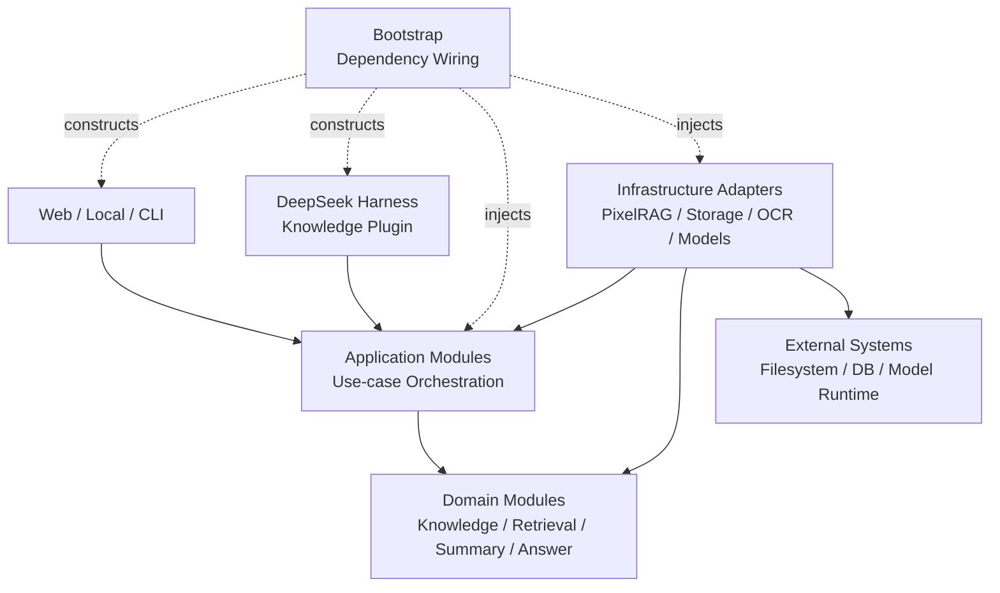

# PDF Knowledge Agent — 模块化分层架构

> 状态：目标架构，尚未全部实现
>
> 更新日期：2026-08-22
>
> 产品边界来源：[PROJECT_REQUIREMENTS.md](./PROJECT_REQUIREMENTS.md)
>
> 实施顺序来源：[IMPLEMENTATION_PIPELINE.md](./IMPLEMENTATION_PIPELINE.md)

## 1. 文档职责

本文只定义系统的 module、interface、seam、依赖方向和禁止越界规则，不重复定义产品需求，也不把候选技术描述为已经交付。

- `PROJECT_REQUIREMENTS.md`：唯一产品愿景与边界来源；
- `agent_structure.md`：目标 module 结构与依赖规则；
- `IMPLEMENTATION_PIPELINE.md`：按阶段落地和验收顺序；
- `README.md`：面向使用者和贡献者的项目说明。

下方目录是目标能力图，不是要求一次性创建的空目录。只有进入当前实施阶段、并且存在真实 interface 或 adapter 时，才创建相应 package。

## 2. 分层与依赖方向



代码依赖只能向内：

1. Delivery Layer 可以依赖 Application interface 和公开 contracts；
2. Application Layer 可以依赖 Domain interface，但不能依赖具体 adapter；
3. Domain Layer 不依赖 Web、Harness、数据库、文件系统、PixelRAG、PaddleOCR 或具体模型 SDK；
4. Infrastructure Layer 实现由 Domain/Application 拥有的 interface；
5. Bootstrap 是唯一负责选择并组装 adapter 的位置，不包含业务规则；
6. Evaluation、Tests 和 Scripts 通过公开 interface 使用 module，不绕过 interface 检查内部状态。

运行时调用可以从 Application 进入 adapter，但源码 import 方向仍由 Infrastructure 指向它所实现的 interface。Application 只接收已经注入的 interface 实例。

## 3. 目标目录结构

```text
pdf_knowledge_agent/                  # Python package namespace
├─ apps/                              # Delivery Layer
│  ├─ web/
│  │  ├─ frontend/
│  │  └─ backend/                     # HTTP 输入映射，不放领域算法
│  ├─ local/
│  └─ cli/
│
├─ harness/                           # Agent Delivery Adapter
│  ├─ profile/
│  ├─ bundle/
│  ├─ session/
│  ├─ prompts/
│  ├─ sandbox/
│  └─ knowledge-plugin/
│     ├─ tools/
│     ├─ schemas/
│     ├─ guards/
│     ├─ transport/
│     └─ result-mapping/
│
├─ application/                       # Use-case orchestration
│  ├─ ingest_source/
│  ├─ inspect_source/
│  ├─ summarize_sources/
│  ├─ search_evidence/
│  ├─ answer_query/
│  ├─ compare_sources/
│  ├─ get_artifact/
│  ├─ refresh_source/
│  └─ delete_source/
│
├─ domain/                            # Vendor-independent domain modules
│  ├─ knowledge/
│  │  ├─ models/                      # Document, Page, Locator, Artifact, State
│  │  ├─ repository_interface/
│  │  ├─ source_scope/
│  │  ├─ identity/
│  │  ├─ versioning/
│  │  └─ lifecycle/
│  │
│  ├─ content_processing/
│  │  ├─ interface/
│  │  ├─ canonical_page_builder/
│  │  ├─ normalization/
│  │  └─ diagnostics/
│  │
│  ├─ visual_retrieval/
│  │  ├─ interface/
│  │  ├─ request_result/
│  │  └─ metadata_policy/
│  │
│  ├─ text_retrieval/                 # Optional auxiliary path
│  │  ├─ interface/
│  │  └─ request_result/
│  │
│  ├─ retrieval/
│  │  ├─ interface/
│  │  ├─ fusion/
│  │  ├─ deduplication/
│  │  ├─ rerank/
│  │  ├─ evidence_builder/
│  │  └─ sufficiency/
│  │
│  ├─ summary/
│  │  ├─ interface/
│  │  ├─ page_grouping/
│  │  ├─ hierarchical_merge/
│  │  ├─ citation_mapping/
│  │  └─ validation/
│  │
│  ├─ grounded_answer/
│  │  ├─ interface/
│  │  ├─ claim_generation/
│  │  ├─ citation_mapping/
│  │  └─ grounding_validation/
│  │
│  ├─ comparison/
│  └─ memory/
│
├─ infrastructure/                    # Outbound adapters
│  ├─ repositories/
│  │  ├─ local_filesystem/
│  │  ├─ metadata_database/
│  │  ├─ artifact_store/
│  │  └─ in_memory/                   # Test/local adapter when justified
│  │
│  ├─ source_processing_adapters/
│  │  ├─ pdf_renderer/
│  │  ├─ opendataloader/
│  │  └─ paddleocr/
│  │
│  ├─ visual_retrieval_adapters/
│  │  └─ pixelrag/
│  │
│  ├─ text_retrieval_adapters/
│  ├─ model_adapters/
│  │  ├─ multimodal_reader/
│  │  ├─ reranker/
│  │  └─ agent_model/
│  ├─ workers/
│  ├─ queue/
│  ├─ cache/
│  ├─ observability/
│  └─ security/
│
├─ contracts/                         # 仅放跨进程、跨语言或持久化 schema
│  ├─ tool_schemas/
│  ├─ http_schemas/
│  ├─ event_schemas/
│  ├─ artifact_export_schemas/
│  └─ schema_versions/
│
└─ bootstrap/                         # Config 与 adapter 组装

Repository-level support directories:
├─ spikes/                            # 可丢弃的技术验证；生产 module 不得依赖
├─ evaluation/                        # Vendor-independent 评测 module 与数据
├─ tests/
├─ scripts/
├─ configs/
├─ docs/
└─ README.md
```

## 4. Layer 的职责边界

### 4.1 Delivery Layer：`apps/` 与 `harness/`

职责：

- 接收 HTTP、CLI、桌面 UI 或 Agent Tool 输入；
- 完成协议级解析、基础 schema 校验和身份上下文提取；
- 调用一个 Application interface；
- 把 Application result 映射为 HTTP、CLI 或 Tool result。

不得：

- 直接访问文件系统、向量数据库、PixelRAG、OCR 或模型 SDK；
- 实现检索、总结、权限、引用或版本算法；
- 让模型提供任意本地路径、SQL、Shell 或 vendor 参数。

`harness/knowledge-plugin` 是 DeepSeek Harness 到 Application Layer 的 adapter。它必须保持薄，只负责 Tool 注册、schema、scope guard、transport 和错误映射。

### 4.2 Application Layer：`application/`

职责：

- 每个 module 表达一个用户可观察的 use case；
- 编排授权、事务、Domain module、adapter、状态变更和失败补偿；
- 返回结构化结果，不返回具体 SDK 对象；
- 定义 use case 所需的依赖 interface，并由 Bootstrap 注入 adapter。

不得：

- 复制 Domain module 内部算法；
- 出现 PixelRAG manifest、FAISS index、PaddleOCR result 或 OpenDataLoader raw node；
- 把 use case 拆成大量只有一次转发的 helper module。

Application module 的建议外部 interface：

```text
ingest_source(command) -> IngestionResult
inspect_source(query) -> SourceDetails
summarize_sources(command) -> SummaryArtifactRef
search_evidence(query) -> EvidenceSet
answer_query(command) -> GroundedAnswer
compare_sources(command) -> ComparisonArtifactRef
```

这些是 use-case interface，不等同于内部函数清单。内部步骤应隐藏在 module implementation 中。

### 4.3 Domain Layer：`domain/`

职责：

- 保存稳定领域语言、invariant 和计算规则；
- 拥有 `Document`、`Page`、`SourceLocator`、`SourceScope`、`Evidence`、`SummaryArtifact`、`ProcessingState` 等模型；
- 定义调用外部能力所需的 interface；
- 在不启动 Web、Harness、数据库或外部模型的情况下可测试。

不得：

- import vendor SDK 或读取环境变量；
- 构造具体 adapter；
- 依赖具体部署路径或进程拓扑；
- 把持久化 DTO 当作唯一领域模型。

### 4.4 Infrastructure Layer：`infrastructure/`

职责：

- 实现 repository、renderer、parser、OCR、retrieval 和 model interface；
- 把 vendor 数据转换为项目领域模型；
- 封装重试、超时、连接、批处理、资源使用和 vendor 错误；
- 提供可替换的生产 adapter，以及确有测试或本地用途时的 fake/in-memory adapter。

不得：

- 决定 source scope 或用户权限；
- 生成最终答案或总结策略；
- 让 vendor ID、路径和返回对象越过 adapter seam；
- 修改领域 invariant 来迎合某个 vendor 的私有格式。

### 4.5 `contracts/` 与 `bootstrap/`

`contracts/` 只承载必须版本化的外部 schema，例如 Harness Tool JSON Schema、HTTP payload、worker event 和 artifact export。普通 Python module 之间不要通过中央 DTO 目录通信，interface 所需类型由拥有该 interface 的 module 就近维护。

`bootstrap/` 是 composition root：读取配置、构造 adapter、注入 Application module。除组装与启动外，不包含业务行为。

## 5. 核心 module interface 与 seam

| Module | 外部 interface | Module 内部拥有 | 明确排除 |
|---|---|---|---|
| Knowledge | 注册来源、加载授权 scope、提交或读取版本 | 稳定 ID、Canonical Page、Source Locator、版本生命周期、artifact 引用 | Embedding、检索排序、模型调用 |
| Content Processing | `build_canonical_pages(source, capabilities)` | 页面顺序、可选文本/结构合并、诊断、规范化 | 文件授权、索引、总结、问答 |
| Visual Retrieval | `index_pages(...)`、`search(...)` | 项目 request/result、page/tile 映射规则、检索诊断 | PixelRAG 命令参数、最终 Evidence 融合、权限 |
| Text Retrieval | `index_text(...)`、`search(...)` | 关键词或文本召回结果 | 视觉检索替代、最终回答 |
| Retrieval | `retrieve_evidence(query, scope)` | 多路召回、去重、融合、rerank、sufficiency、Evidence 构造 | Reader 回答生成、任意扩权 |
| Summary | `summarize(scope, options)` | 全页面遍历、分组、层级聚合、引用与忠实度验证 | 用 Top-K 代替完整覆盖、动态问答 |
| Grounded Answer | `answer(query, evidence)` | 证据阅读、claim、引用映射、grounding validation | Repository 或 vector store 直连、再次扩大 scope |
| Comparison | `compare(scope, question)` | 跨文档证据组织和差异产物 | 修改来源内容、绕过 Evidence |
| Knowledge Plugin | Harness Tools | schema、guard、transport、result mapping | 任何领域算法或 vendor SDK |

### 5.1 Knowledge Repository seam

Repository interface 由 Knowledge module 拥有，adapter 由 Infrastructure 实现。Repository 对调用者暴露项目领域对象，不暴露 SQL row、文件路径布局、Qdrant payload 或 PixelRAG manifest。

Repository 必须保证：

- `document_id`、`page_id` 和 `source_locator` 稳定且唯一；
- 新版本完整验证前，旧版本继续可读；
- 原始来源和 Canonical Page 是权威数据；
- Embedding、索引和 cache 是可重建派生数据；
- 删除或更新来源时，可以定位并失效全部派生数据和 artifact。

### 5.2 Visual Retrieval seam

Visual Retrieval interface 使用项目自己的 ID 和类型：

```text
VisualSearchRequest
├─ query
├─ authorized_source_scope
├─ top_k
└─ optional_filters

VisualSearchResult
├─ document_id
├─ page_id
├─ source_locator
├─ score
├─ representation_ref
└─ diagnostics
```

`PixelRagVisualRetrievalAdapter` 可以在内部执行 render、tile、embed、index 和 search，但下列内容不能穿过 seam：

- PixelRAG 私有 manifest schema；
- tile 文件命名规则；
- FAISS/Qdrant 内部 ID；
- CLI 参数和进程管理细节；
- Qwen 模型输入对象或 tensor。

只有当 PixelRAG adapter 与测试 fake/in-memory adapter 都通过相同 interface 测试时，该 seam 才成为真实、可替换的 seam。

### 5.3 Evidence seam

所有 retrieval channel 必须转换为统一 `Evidence` 后，Grounded Answer 才能读取：

```text
Evidence
├─ evidence_id
├─ document_id
├─ page_id
├─ source_locator
├─ representation_type
├─ retrieval_channel
├─ retrieval_score
├─ page_image_ref
├─ optional_text
└─ diagnostics
```

Visual Retrieval result 是候选结果，不直接等于最终 Evidence。Retrieval module 负责 scope 校验后的融合、去重、rerank、sufficiency 和 Evidence 构造。

### 5.4 Optional capability seams

Native parser、OCR 和 text retrieval 都是可选 adapter：

- 缺少 PaddleOCR 依赖时，module 仍应可导入和运行 visual-only 路径；
- OCR 只补充 Canonical Page 的可选文本与诊断，不决定页面是否能进入知识库；
- OpenDataLoader raw schema 在 adapter 内终止；
- optional adapter 失败返回结构化 diagnostics，不以 import-time failure 中断无关路径。

## 6. 不可违反的跨 module invariant

1. **明确授权先于读取**：任何 Repository、检索或总结调用之前必须得到已验证的 `SourceScope`；
2. **ID 归 Knowledge module 所有**：vendor 不生成系统权威 `document_id` 或 `page_id`；
3. **视觉主路径不依赖 OCR 成功**：OCR、原生解析和结构恢复是辅助能力；
4. **静态总结不是检索**：Summary 必须枚举 scope 内所有 Canonical Pages；
5. **Grounded Answer 只消费 Evidence**：不得直连 PixelRAG、Repository、文件路径或 vector store；
6. **索引可重建**：Embedding、FAISS、Qdrant 和 cache 不成为来源事实；
7. **vendor 类型不越过 adapter seam**：所有结果先转换为项目类型；
8. **版本原子切换**：新页面、metadata 和 index 映射验证完成后才能激活新版本；
9. **失败显式化**：`partial`、`failed`、`cancelled` 和 insufficient evidence 不能伪装成成功；
10. **Agent 不扩权**：模型只能通过允许的 Tool 和 `SourceScope` 操作知识系统。

## 7. 主要调用链

### 7.1 Ingestion

```text
Delivery
  -> ingest_source(command)
  -> Authorization + SourceScope
  -> Knowledge identity/version
  -> Renderer adapter
  -> optional Parser/OCR adapters
  -> Content Processing
  -> Knowledge Repository commit
  -> Visual Retrieval index_pages
  -> Validate project page_id/index mapping
  -> Atomically activate version
  -> IngestionResult
```

### 7.2 Dynamic Query

```text
Delivery or Harness Tool
  -> answer_query(command)
  -> Resolve authorized SourceScope
  -> Retrieval.retrieve_evidence
      -> Visual Retrieval adapter
      -> optional Text Retrieval adapter
      -> fusion / rerank / sufficiency
      -> EvidenceSet
  -> Grounded Answer.answer(query, evidence)
  -> GroundedAnswer + citations + limitations
```

### 7.3 Static Summary

```text
Delivery or Harness Tool
  -> summarize_sources(command)
  -> Resolve authorized SourceScope
  -> Repository enumerates every Canonical Page
  -> Summary.summarize
  -> SummaryArtifact + citations + validation
  -> Repository stores versioned artifact
```

## 8. 当前代码到目标 module 的归属

当前文件不是目标 package 结构已经落地的证明。迁移应由测试保护并按 vertical slice 进行，不做一次性大搬家。

| 当前文件 | 当前职责 | 目标归属 | 迁移约束 |
|---|---|---|---|
| `combine_format.py` | Canonical 类型、native/OCR 合并、页面内容生成 | `pdf_knowledge_agent/domain/content_processing` 与 `pdf_knowledge_agent/domain/knowledge` | 先分离稳定领域类型与 OpenDataLoader/OCR 私有格式 |
| `PDF_JSON_Fix.py` | OpenDataLoader 输出修正策略 | Content Processing 内部 normalization policy | 不作为公共 helper 集合暴露 |
| `OpenDataLoaderSchema.py` | raw schema 分析和 OCR 页面判定 | `pdf_knowledge_agent/infrastructure/source_processing_adapters/opendataloader` | raw node 不得进入 Domain/Application interface |
| `pdf_read.py` | 当前端到端 runner 与依赖构造 | `pdf_knowledge_agent/application/ingest_source` + `bootstrap` + legacy CLI | 移除 import-time OCR 强依赖，入口只做组装与调用 |
| `chunking.py` | 基于文本和 section 的 chunk | Summary 或 optional Text Retrieval 内部 implementation | Chunk 不替代 Canonical Page，也不进入视觉主路径 |
| `show_pdf_json_result.py` | CLI 与 LLM JSON export | `apps/cli` 或 artifact export adapter | 不重新执行或复制领域算法 |

## 9. 测试边界

- 每个深 module 通过自己的外部 interface 测试；
- Application 测试使用 in-memory/fake adapter，断言用户可观察结果；
- PixelRAG、OpenDataLoader、PaddleOCR、数据库和模型属于 adapter integration tests；
- Contract tests 对同一 interface 运行生产 adapter 与 fake adapter；
- End-to-end tests 只覆盖少量代表性 vertical slice；
- 测试不得依赖 adapter 私有文件名、内部函数调用顺序或 tensor 内容；
- optional dependency 缺失时，只跳过对应 integration test，不影响纯 Domain 和其他 Application 测试。

## 10. 分阶段物理化规则

Stage 0 只创建锁定 interface 与评测样本所需的最小结构：

```text
pdf_knowledge_agent/domain/knowledge
pdf_knowledge_agent/domain/visual_retrieval
evaluation/retrieval
tests/knowledge_contract_test.py
tests/visual_retrieval_contract_test.py
tests/retrieval_evaluation_test.py
```

Stage 1 的 PixelRAG 验证放在项目指定的 `PixelRAG/`，生产 module 不得依赖 spike 代码。只有 Spike 达到采用门槛后，Stage 2 才物理化：

```text
pdf_knowledge_agent/application/search_evidence
pdf_knowledge_agent/infrastructure/visual_retrieval_adapters/pixelrag
pdf_knowledge_agent/infrastructure/repositories/in_memory
tests/integration/visual_retrieval
```

其他目录在对应 Stage 开始前不创建。进入新 Stage 时必须同时满足：

1. module interface 已写明输入、输出、invariant 和错误模式；
2. 至少一个真实调用者需要该 module；
3. adapter seam 存在真实变化来源，或明确需要 production + test adapter；
4. 测试通过 interface 验证行为；
5. vendor 细节没有扩散到上层；
6. `PROJECT_REQUIREMENTS.md` 的产品边界没有被实现选择改写。
