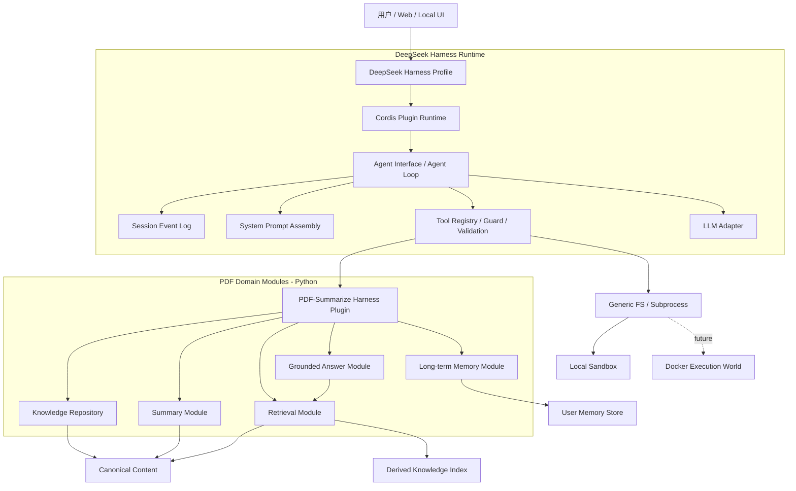

# PDF-Summarize Agent 架构

> 状态：已确认的架构基线，尚未实现  
> 日期：2026-08-19  
> Agent Runtime：DeepSeek Harness  
> 产品需求来源：[PROJECT_REQUIREMENTS.md](./PROJECT_REQUIREMENTS.md)

## 1. 文档目的

本文定义 `PDF-summarize` 的 Agent 架构、模块职责和关键 seam。它回答以下问题：

- DeepSeek Harness 负责什么；
- PDF-Summarize 自己负责什么；
- Tools、Memory、Retrieval、Session 和 Sandbox 如何协作；
- Node.js Harness 与现有 Python 文档后端如何隔离变化；
- 第一版实现什么，哪些能力明确延后。

本文是技术架构基线，不替代产品需求。若本文与 `PROJECT_REQUIREMENTS.md` 的用户流程、可追溯性或阶段要求冲突，以后者为准。

## 2. 当前事实与决策状态

### 2.1 已验证的当前实现

当前 Python 流水线已经具备或正在承载以下能力：

- PDF 原生解析；
- 按需 OCR 的判断和补充；
- Canonical Document 统一内容事实层；
- 保留章节、页码和内容块来源的结构感知切块；
- 面向下游消费的 `PDF_Output/analysis/llm_input.json`。

当前 `llm_input.json` 的文档 chunk 包含：

- `chunk_id`；
- `ordinal`；
- `text`；
- `character_count`；
- `section_path`；
- `page_numbers`；
- `block_ids`。

### 2.2 尚未实现

以下内容目前都是目标架构，不得描述为已经交付：

- DeepSeek Harness Profile、Bundle 和 PDF Plugin；
- 静态总结模块；
- Embedding、索引、检索和重排；
- Grounded Answer；
- Agent Tools；
- Session 范围状态；
- 长期记忆；
- 项目专用 Sandbox 配置；
- Docker 解析 worker 或 Docker execution world。

### 2.3 已确认的技术决策

1. DeepSeek Harness 是本项目唯一的 Agent Runtime。
2. 项目不自行实现 Agent Loop、Session 日志或通用 Tool Registry。
3. PDF 能力通过 Harness Plugin 接入，而不是修改 Harness Core。
4. Canonical Content 是文档事实的唯一来源；索引、摘要和记忆都不能替代它。
5. 第一版默认不向模型开放任意 PowerShell、Python 或文件删除能力。
6. 第一版使用 Harness 本地 Sandbox；Docker 优先用于隔离不可信 PDF 解析/OCR，而不是替代 Harness。
7. DeepSeek Harness 仍处于 Developer Preview。实现时必须固定经过验证的版本或 commit，不能无约束追踪最新分支。

## 3. 总体架构



架构分为四层：

1. **产品入口层**：Web、Headless 或未来本地 UI，只负责收集用户意图、资料范围和展示结果。
2. **Harness 运行层**：负责 Agent 循环、Session、Prompt、LLM、Tools 流水线和执行策略。
3. **PDF Plugin seam**：把 Harness 的工具调用转换为 PDF 领域请求，并把领域结果转换为规范工具结果。
4. **PDF 领域层**：负责知识事实、总结、检索、证据回答和长期记忆，不依赖具体 Agent Loop。

## 4. DeepSeek Harness 地基

### 4.1 组合平面

DeepSeek Harness 使用 Cordis 插件树组合运行时：

- **Profile**：定义一次具体启动采用哪些 Bundle 和 patch；
- **Bundle**：组合一组可复用插件；
- **Plugin**：贡献工具、Prompt section、事件处理或能力实现；
- **Patch**：针对具体部署覆盖组合配置。

项目应新增自己的 PDF Bundle/Profile，不修改官方 `dsh-base` 或默认 Agent Loop。

### 4.2 运行主干

Harness 负责：

- `session`：追加式 Session Event 日志；
- `system-prompt`：系统提示词和模型可见工具 Schema 的组装；
- `tools`：工具注册、范围限制、执行守卫、参数与结果校验；
- `agent`：公共 Agent interface；
- `agent-loop`：默认 Agent interface 实现；
- `llm`：模型 adapter seam；
- `fs` / `subprocess` / `sandbox`：通用文件和命令执行能力。

PDF Plugin 只依赖公共 interface，不依赖默认 `agent-loop` 的内部实现。

### 4.3 单轮调用链

```text
用户输入
  -> 写入 Session Event Log
  -> 根据 Session 投影模型上下文
  -> 组装 System Prompt 与 Tool Schema
  -> LLM streaming
  -> 解析 Tool Call
  -> Tool Guard / Approval / 参数校验
  -> PDF Plugin 或受限执行能力
  -> 结果校验并写回 Session
  -> 继续推理或结束当前 turn
```

Session Event Log 是会话状态的事实来源。不得另外维护一套与其竞争的“完整聊天历史”。

## 5. PDF 领域模块

每个模块应以小 interface 隐藏复杂实现。入口层和 Harness Plugin 不得复制领域规则。

### 5.1 Knowledge Repository

职责：

- 按 `source_id` / `source_set` 读取 Canonical Content；
- 返回带稳定来源定位的文档、chunk 和内容块；
- 验证资料是否存在、是否处理完成以及版本是否匹配；
- 隐藏当前 JSON 文件和未来数据库之间的存储差异。

不负责：

- 对话历史；
- LLM 推理；
- 把索引当作原始事实；
- 允许模型直接传入任意本地路径。

### 5.2 Summary Module

职责：

- 为单份或多份资料生成静态总结；
- 对长文档执行分层总结，而不是一次塞入完整上下文；
- 多文档场景保留单文档结果，并生成共同点、差异和综合结果；
- 输出人类可读结果和结构化结果；
- 每个重要结论携带 `SourceReference`。

静态总结是稳定领域流程，不应依赖 Agent 自由规划才能正确完成。Agent 只能选择何时调用、使用哪个用户授权的资料集合和如何向用户解释结果。

### 5.3 Retrieval Module

职责：

- 从 Canonical Content 构建可重建索引；
- 在明确的 `source_scope` 内执行关键词、向量或混合检索；
- 重排候选证据；
- 返回带来源定位、相关度和必要诊断信息的 Evidence 集合。

Embedding 模型、向量数据库和重排器位于模块内部 seam；在至少存在生产 adapter 和测试 adapter 前，不提前制造多余抽象。

### 5.4 Grounded Answer Module

职责：

- 只基于 Retrieval Module 返回的 Evidence 生成回答；
- 保留文档、页码和内容块引用；
- 证据不足时明确拒绝推断；
- 多份资料冲突时保留分歧，不伪造统一结论；
- 将“资料原文”“用户输入”“模型生成内容”和“系统推断”区分开。

### 5.5 Long-term Memory Module

职责：

- 保存经过规则允许的用户偏好或长期工作习惯；
- 支持查看、纠正、删除和过期；
- 为当前 turn 返回少量相关长期上下文；
- 记录来源、写入原因、时间和作用域。

长期记忆不是 PDF 事实库，也不是完整聊天日志。

## 6. Memory 架构

本项目将“记忆”拆为四类，分别拥有不同事实来源和生命周期。

| 类型 | 事实来源 | 典型内容 | 生命周期 | 所属模块 |
|---|---|---|---|---|
| 文档事实 | Canonical Content | 原文、结构、页码、内容块 | 随知识源版本存在 | Knowledge Repository |
| 会话工作记忆 | Session Event Log | 用户消息、模型消息、工具调用与结果 | 当前 Session | DeepSeek Harness |
| 任务状态 | Session typed events / projection | 当前资料范围、当前任务、已选摘要产物 | 当前 Session 或任务 | PDF Plugin |
| 用户长期记忆 | User Memory Store | 输出偏好、稳定习惯、用户确认的信息 | 跨 Session，可删除/过期 | Long-term Memory Module |

### 6.1 会话工作记忆

直接使用 DeepSeek Harness Session Event Log。模型看到的历史是事件日志的投影，不另存一份可漂移的 message list。

会话中至少需要表达：

- 用户消息；
- Assistant 消息；
- Tool Call 与 Tool Result；
- 当前 `source_scope`；
- 关键产物引用；
- turn 开始、结束、取消和错误。

PDF Plugin 可以增加类型化事件，例如：

```text
pdf/source-scope-set
pdf/summary-created
pdf/evidence-selected
pdf/task-failed
```

事件保存状态变化和稳定标识，不重复嵌入整份 PDF 正文。

### 6.2 任务状态

`source_scope` 必须由用户或产品入口确定。Agent 可以查询当前范围，但不得悄悄把问题扩大到未授权资料。

任务状态的最小内容：

- `session_id`；
- `source_scope`；
- 当前用户目标；
- 已生成 artifact 的稳定 ID；
- 最近使用的 Evidence 引用；
- 失败或取消状态。

### 6.3 长期记忆

第一版 RAG 可以不实现长期记忆。加入时遵守：

1. 默认不把文档内容复制进用户长期记忆；
2. 用户明确表达的偏好可以直接候选化；
3. 模型推断出的偏好不能静默永久保存；
4. 每条记录包含 provenance、scope、created_at、updated_at 和可选 expires_at；
5. 用户可以查看和删除；
6. 召回结果只能辅助表达和流程选择，不能覆盖 Canonical Content 的事实。

### 6.4 上下文组装顺序

一次回答的上下文优先级为：

```text
系统约束
  > 用户当前问题
  > 用户确认的 source_scope
  > 当前检索 Evidence
  > 必要的 Session 摘要
  > 相关长期偏好
```

文档 Evidence 和长期记忆必须带类型标签，禁止混为一段无来源文本。

## 7. Tools 架构

### 7.1 Tool 的职责

Harness Tool 是 Agent 接触领域能力的受控 interface。每个 Tool 必须包含：

- 清晰、窄范围的用途；
- 可校验的输入 Schema；
- Canonical JSON 输出；
- 超时和取消处理；
- 稳定错误类型；
- 来源引用；
- 是否需要用户批准的策略；
- 不向模型泄露的内部诊断日志。

通用输出 envelope：

```json
{
  "status": "ok | partial | error",
  "data": {},
  "source_refs": [],
  "warnings": [],
  "error": null
}
```

这只是跨 Tool 的结果约定，不要求所有 Tool 使用同一个庞大参数对象。

### 7.2 第一组模型可见 Tools

| Tool | 用途 | 主要限制 |
|---|---|---|
| `list_sources` | 查看当前用户可用及已处理资料 | 只返回授权范围和稳定 ID |
| `inspect_source` | 查看资料元数据、处理状态和章节概览 | 不返回任意路径，不默认返回全文 |
| `search_evidence` | 在当前资料范围检索证据 | 必须带 `source_scope`，返回引用 |
| `summarize_sources` | 生成或取得静态总结 | 仅允许用户已确认的资料范围 |
| `compare_sources` | 比较多份资料的共同点和差异 | 至少两份资料，结论逐项引用 |
| `get_artifact` | 读取已生成的摘要等稳定产物 | 只能读取当前用户有权访问的 artifact |

Tool 名称是架构草案，实施前可以调整；职责分配不能被合并成一个万能 `run_pdf_task`。

### 7.3 不交给模型自由调用的操作

以下操作由 UI、确定性工作流或管理员执行：

- 上传、授权或删除知识源；
- 设置和扩大 `source_scope`；
- 全量重建索引；
- 修改 Canonical Content；
- 删除 Session 或长期记忆；
- 修改 Sandbox 策略；
- 执行任意 PowerShell、Python 或系统命令。

### 7.4 Tool 执行流水线

```text
LLM Tool Call
  -> Harness Schema Validation
  -> Scope Guard
  -> Permission / Approval Policy
  -> PDF Plugin Adapter
  -> PDF Domain Module
  -> Result Validation
  -> Tool Result Event
  -> Model-visible Presentation
```

鉴权、用户资料范围和危险操作判断必须发生在模型之外。模型提出的参数永远视为不可信输入。

## 8. PDF Harness Plugin

PDF Harness Plugin 是 DeepSeek Harness 与 Python 领域层之间的唯一正式 seam。

它负责：

- 注册 PDF Tools；
- 注入简短的 PDF 行为约束和引用规则；
- 订阅或写入 PDF typed session events；
- 将 Tool 参数转换为领域请求；
- 将领域结果转换为 Canonical Tool Result；
- 传递取消信号、trace ID 和稳定错误；
- 在插件卸载时撤销注册和资源。

它不负责：

- 实现摘要算法；
- 直接查询向量数据库；
- 拼接完整 PDF Prompt；
- 自行保存第二套 Session；
- 绕过 Knowledge Repository 读取私有 JSON 结构。

### 8.1 Node.js 与 Python seam

DeepSeek Harness 运行于 Node.js/TypeScript，现有 PDF 主干位于 Python。二者通过一个拥有稳定领域请求/结果语义的 adapter 连接。

当前不锁定 HTTP、stdio JSON-RPC 或其他传输方式。实现时应选择一个生产 adapter，并提供一个内存测试 adapter；传输细节不能进入 Tools 的模型可见 interface。

至少需要传递：

- `request_id` / `trace_id`；
- `user_scope`；
- `source_scope`；
- 领域命令和经过校验的参数；
- deadline / cancel；
- 结构化结果、引用、警告和错误。

## 9. Sandbox 与执行架构

### 9.1 `ctx.sandbox` 的准确定位

DeepSeek Harness 的本地 `ctx.sandbox` 对同一执行世界中的子进程施加文件影响策略。当前官方本地实现包括：

- Linux：bwrap / Landlock；
- macOS：Seatbelt；
- Windows：ACL restricted-token；
- 策略：`read-only`、`workspace-write`、`danger-full-access`。

它不是 Docker 管理器，也不自动提供完整网络隔离。Windows 等平台可能报告 `partial` enforcement，必须将此状态暴露到诊断信息中。

### 9.2 第一版策略

第一版采用：

```text
Harness local sandbox
+ workspace-write（仅确有文件输出需要时）
+ PDF domain tools
- model-visible arbitrary shell
- model-visible arbitrary file path
- model-visible delete/write tools
```

读取 Canonical Content、检索和总结属于受信任的 PDF 领域执行路径，不应通过模型编写 Shell 命令完成。

### 9.3 Docker 解析 worker

对于公开网站接收的不可信 PDF，后续可将以下工作放入短生命周期 Docker worker：

- PDF parser；
- OCR；
- 图片和临时文件处理；
- 资源限制与超时；
- 禁止或限制网络；
- 任务结束后销毁临时工作区。

Docker worker 隔离的是文档处理负载，不等于 Harness 的 Agent Sandbox。

### 9.4 完整 Docker execution world

只有当 Agent 必须在容器中自由读写和执行命令时，才考虑完整 Docker execution world。此时必须让以下能力指向同一容器：

```text
Docker lifecycle
Docker-backed ctx.fs
Docker-backed ctx.subprocess
```

不能只把命令放进容器、却让 `ctx.fs` 继续读取宿主机，否则 Agent 看到的文件状态会分裂。该能力不属于第一版范围。

## 10. 安全与权限原则

1. 用户资料范围由确定性代码验证，不能信任模型自报权限。
2. Tool 参数、领域输入和领域输出都必须校验。
3. 发送给外部 LLM 的内容只包含完成当前任务所需的最小 chunk。
4. 日志不得记录模型密钥、完整私密 PDF 或认证信息。
5. 删除、覆盖、扩大资料范围等行为必须由用户明确触发。
6. 工具输出中的路径应使用稳定 ID 或相对定位，不暴露不必要的宿主机绝对路径。
7. Canonical Content 与用户原始资料的保存和删除策略必须一致且可解释。
8. Sandbox 为纵深防御，不能替代 Tool allowlist、鉴权和领域校验。

## 11. 状态与可观察性

### 11.1 资料状态

建议使用明确状态，而不是通过文件是否存在推断：

```text
received
  -> parsing
  -> canonicalized
  -> chunked
  -> indexed
  -> ready

任一步骤 -> partial | failed | cancelled
```

静态总结是 `ready` 资料上的独立 artifact，不应成为资料是否可检索的唯一状态。

### 11.2 Trace

一次用户请求至少关联：

- `session_id`；
- `turn_id`；
- `tool_call_id`；
- `trace_id`；
- `source_scope`；
- 领域 artifact / Evidence ID；
- 关键耗时、warning 和 error code。

Harness Session 记录面向交互的事实；领域日志记录解析、索引和模型调用诊断。两者通过 ID 关联，不互相复制所有内容。

## 12. 建议的目标目录

以下是目标结构，不代表当前目录已经迁移：

```text
PDF-summarize/
├── agent/
│   ├── plugins/
│   │   └── pdf-summarize/       # Harness Plugin、Tools、Prompt、events
│   ├── bundles/
│   │   └── pdf-summarize/       # PDF Agent Bundle
│   └── profiles/
│       ├── pdf-web/             # Web 运行组合
│       └── pdf-headless/        # 测试/批处理组合
├── pdf_summarize/
│   ├── knowledge/               # Knowledge Repository
│   ├── summarization/           # 静态总结
│   ├── retrieval/               # 索引、检索、重排
│   ├── answering/               # Grounded Answer
│   ├── memory/                  # 长期记忆
│   └── transport/               # Node/Python production adapter
├── PDF_Output/
│   └── analysis/                # Canonical、chunks、可重建派生物
├── tests/
│   ├── contract/                # Plugin 与 Python seam 合约测试
│   ├── integration/             # Summary / Retrieval / Answer 流程
│   └── e2e/                     # Harness turn 到引用答案
├── agent_structure.md
└── PROJECT_REQUIREMENTS.md
```

目录迁移应随模块实现逐步进行，不为追求目录外观一次性搬动现有稳定代码。

## 13. 测试策略

### 13.1 Harness Plugin 合约测试

- Tool Schema 可被 Harness 注册；
- 无权访问的 `source_id` 被拒绝；
- Tool Result 符合输出约定；
- 取消和超时能够传到 Python；
- 插件卸载后注册被撤销；
- 领域错误不会退化成无结构文本。

### 13.2 领域模块测试

- 单文档和多文档同样成立；
- 长文档不会依赖单次上下文；
- 引用能够回到正确文档和页码；
- 证据不足和文档冲突被正确表达；
- 索引删除后可由 Canonical Content 重建。

### 13.3 Memory 测试

- Session 投影可从事件日志重建；
- `source_scope` 不会在追问中静默扩大；
- 长期记忆不会覆盖文档 Evidence；
- 用户删除后不再被召回；
- 过期和不同用户作用域正确隔离。

### 13.4 Sandbox 与安全测试

- 模型不可调用未注册 Shell；
- 路径逃逸被拒绝；
- `workspace-write` 不能写出工作区；
- Windows partial enforcement 被显式记录；
- Docker worker 超时后可以回收，且临时数据不会残留。

## 14. 分阶段实施顺序

### Step 1：Harness 最小接入

- 固定 DeepSeek Harness 版本；
- 建立 PDF Bundle/Profile；
- 注册一个只读 `list_sources` Tool；
- 用 fake adapter 完成一次可验证 turn；
- 验证 Session 中存在 tool call/result 事件。

### Step 2：Knowledge Repository 与静态总结

- 让 Repository 消费当前 `llm_input.json`；
- 实现 `inspect_source`；
- 建立分层静态总结；
- 输出结构化 artifact 和引用。

### Step 3：Retrieval 与 Grounded Answer

- 建立可重建索引；
- 实现 `search_evidence`；
- 完成带引用回答；
- 验证资料冲突和证据不足路径。

### Step 4：多轮任务状态

- 增加 `source_scope` typed event；
- 保持多轮追问范围；
- 增加 Session 压缩策略，但保留原始事件日志。

### Step 5：长期记忆

- 先定义允许写入的记录类型；
- 提供查看、删除和过期；
- 仅在评测证明有价值后加入自动召回。

### Step 6：隔离强化

- 完成 Harness 本地 Sandbox 配置和验证；
- 为公开上传的 PDF 增加 Docker parsing/OCR worker；
- 只有出现真实需求时才设计完整 Docker execution world。

## 15. 非目标

- 不构建无来源约束的通用聊天机器人；
- 不允许 Agent 绕过 Canonical Content 直接把解析器私有输出当事实；
- 不通过一个万能 Tool 承载所有 PDF 行为；
- 不自行复制 DeepSeek Harness 的 Agent Loop、Session 和 Tool Registry；
- 不在第一版开放任意代码执行；
- 不把向量数据库、摘要或聊天记忆当作不可替代的事实层；
- 不为了“看起来像微服务”而提前拆分网络模块。

## 16. 尚待实现阶段决定的事项

以下内容仍未锁定：

- Node.js Plugin 与 Python 后端的生产 transport；
- LLM 供应商和具体模型；
- Embedding 模型；
- 关键词/向量/混合索引实现；
- 重排实现；
- 长期记忆存储；
- Web 框架；
- Docker worker 的运行平台。

这些选择不得改变本文已经确定的职责分配和事实来源。

## 17. 参考资料

- [DeepSeek Harness repository](https://github.com/deepseek-ai/deepseek-harness)
- [DeepSeek Harness architecture](https://github.com/deepseek-ai/deepseek-harness/blob/master/docs/architecture.md)
- [Core subsystem](https://github.com/deepseek-ai/deepseek-harness/blob/master/docs/subsystems/core.md)
- [Tools subsystem](https://github.com/deepseek-ai/deepseek-harness/blob/master/docs/subsystems/tools.md)
- [Session subsystem](https://github.com/deepseek-ai/deepseek-harness/blob/master/docs/subsystems/session.md)
- [Sandbox subsystem](https://github.com/deepseek-ai/deepseek-harness/blob/master/docs/subsystems/sandbox.md)
- [Extension cookbook](https://github.com/deepseek-ai/deepseek-harness/blob/master/docs/cookbook/extension-cookbook.md)
- [HelloAgents 第七章：构建 Agent 框架](https://hello-agents.datawhale.cc/#/./chapter7/%E7%AC%AC%E4%B8%83%E7%AB%A0%20%E6%9E%84%E5%BB%BA%E4%BD%A0%E7%9A%84Agent%E6%A1%86%E6%9E%B6)
- [HelloAgents 第八章：记忆与检索](https://hello-agents.datawhale.cc/#/./chapter8/%E7%AC%AC%E5%85%AB%E7%AB%A0%20%E8%AE%B0%E5%BF%86%E4%B8%8E%E6%A3%80%E7%B4%A2)

